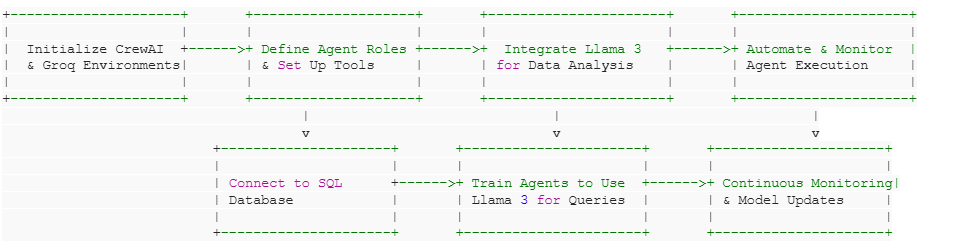
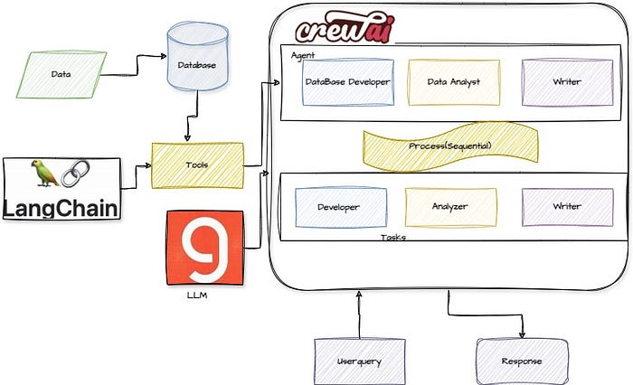

# 🧠 SQL Agent with CrewAI, Groq & Llama 3 — Interactive Natural Language to SQL Interface

## 📌 Overview

This project demonstrates how to build an advanced **SQL Agent System** using open-source technologies including **CrewAI**, **Groq**, and **Llama 3 (8B)**. The system uses intelligent agents capable of generating SQL queries from natural language inputs, executing them against a **SQLite database**, and providing human-readable insights.

By combining large language models (LLMs) with modular, role-based AI agents, this system offers a flexible, scalable, and interpretable method for interacting with relational data. This approach transcends traditional RAG (Retrieval-Augmented Generation) by enabling agents to perform **direct data reasoning** using structured query responses.

---

## 🚀 Features

- ✅ Natural language to SQL conversion using LLMs
- ✅ SQL validation and execution via agent tools
- ✅ Role-based CrewAI agents: Developer, Analyst, and Editor
- ✅ Integration-ready with Groq's LPU hardware acceleration
- ✅ Modular toolset for reusable and extensible agent logic
- ✅ Supports SQLite database (`salaries.db`)

---

## 🧩 Technologies Used

| Component    | Description |
|--------------|-------------|
| 🧑‍💻 **CrewAI** | Manages and coordinates AI agents with specific roles and responsibilities. |
| 🧠 **Llama 3 (8B)** | Foundation LLM used to generate SQL and interpret results. |
| ⚡ **Groq** | Accelerates LLM inference and SQL analytics for faster processing. |
| 🗃️ **SQLite** | Lightweight relational database used for query execution. |
| 🐍 **Python 3.11** | Primary programming language for implementation. |

---

## 🏗️ System Architecture


## Flow Diagram


# 🧠 Agents and Their Roles

### Database Developer Agent
- Constructs and validates SQL queries using tools like `get_schema`, `generate_sql`, `validate_sql`, and `execute_sql`.

### Data Analyst Agent
- Analyzes structured query results and generates meaningful insights using the `analyze_data` tool.

### Editor Agent
- Summarizes the analyst’s interpretation into a concise, executive report using the `editor_tool`.

---

# 🔧 Tools Overview

| Tool Name     | Purpose                                                             |
|---------------|---------------------------------------------------------------------|
| `get_schema`  | Extracts and displays the schema of the connected SQL database      |
| `generate_sql`| Converts user questions into valid SQL queries using LLM            |
| `validate_sql`| Checks the syntactic and semantic correctness of SQL queries        |
| `execute_sql` | Executes SQL against the SQLite database and returns results        |
| `analyze_data`| Transforms raw SQL result into readable insights                    |
| `editor_tool` | Refines insights into a structured summary                          |

---

# 📈 Benefits of SQL Agent over Traditional RAG

| RAG                                  | SQL Agent                                        |
|--------------------------------------|--------------------------------------------------|
| Works on unstructured documents      | Works directly on structured databases           |
| Contextual chunk-based retrieval     | Flexible and precise querying                    |
| Less accurate for numeric/logical    | Highly accurate for logic-/number-based queries  |
| Requires vector stores               | Leverages existing SQL infra                     |

---

# 🧠 Why Use Groq?

- 🚀 **High-speed inference** for LLMs  
- 💡 **Energy-efficient** processing of complex models like **Llama 3 70B**  
- ⚙️ Perfect for **low-latency SQL + NLP workloads**

---

# 📝 Future Enhancements

- 🔌 Add support for **Postgres / MySQL** backends  
- 🧵 Integrate **memory** for multi-turn conversations  
- 📡 Add **API endpoints** via Flask or FastAPI  
- 📊 Visualize results with charting libraries like **Plotly** or **Altair**

---

# ✍️ Author

**Anoop Srivastava**  
Published in *AI Agent Insider*, **April 2025**  
📌 *"How CrewAI and Groq Can Automate the SQL Workload"*


# 📝 Set up the environment for:

#### 1. GROQ_API_KEY


# 🧪 How to Run

### 1. Install Dependencies (with python 3.11)
```bash
pip install -r requirements.txt
```